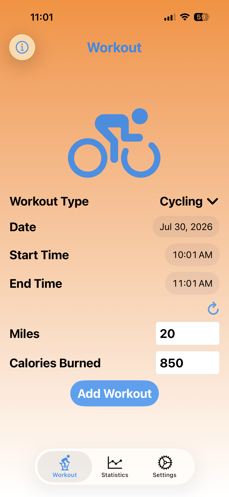
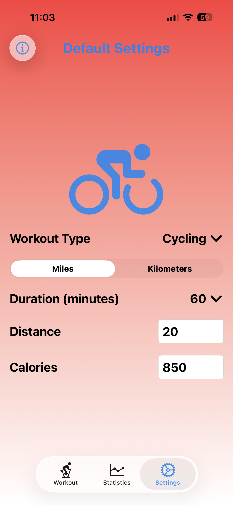
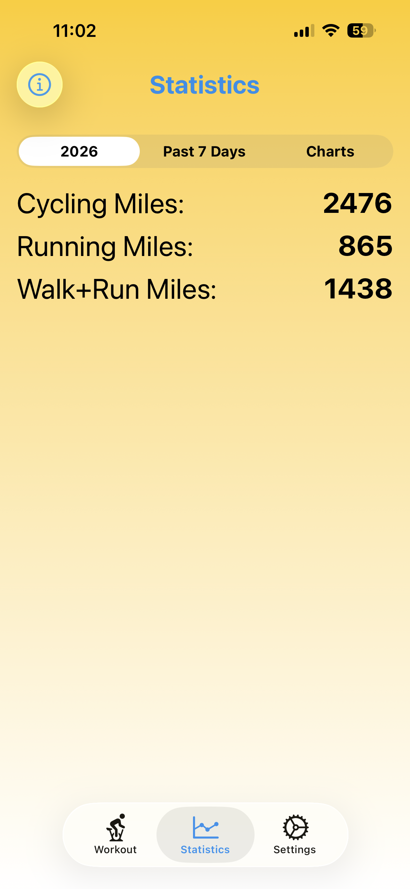
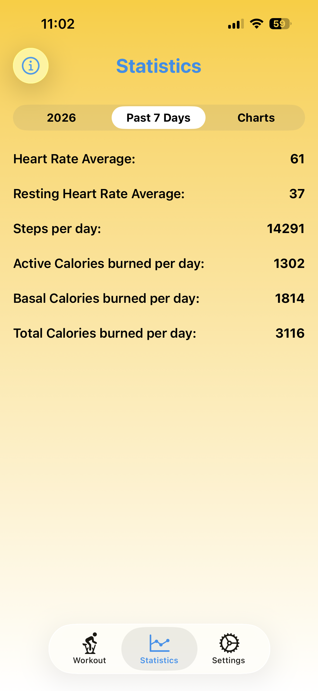
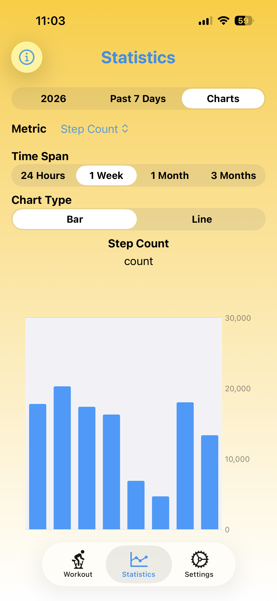
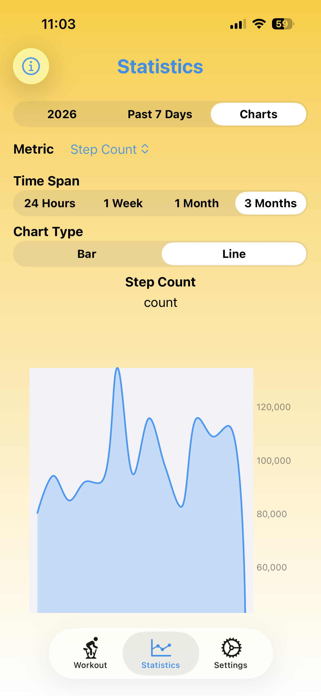

# Workout Entry

The iOS Health app writes to and reads from a database of health information
using HealthKit.  The data this stores includes:

- workouts (cycling, running, swimming, walking, ...)
- activity ring data
  (Move - calories burned, Exercise - minutes, and Stand - hours)
- steps
- heart rate
- resting heart rate
- body mass index (BMI)
- weight
- and much more

Many exercise-related iOS apps write to the health database.
For example, the Nike Run Club app records running workouts and
the ELEMNT cycling app (for Wahoo bike computers) records cycling workouts.
But some exercise equipment doesn't send workout data to any app.
Examples include some treadmills and spinning bikes.
In those cases, users need to manually record their workouts.
This can be done using the Health app, but the process is tedious.

To manually add a workout in the Health app:

- open the Health app
- if "Workouts" isn't pinned to the Summary screen, tap "Show All Health Data"
- tap "Workouts"
- tap the "+" button in the upper-right
- select an "Activity Type" (e.g. Cycling)
- enter data appropriate for the selected activity (e.g. Calories and Distance)
- select the "Starts" day and time
- select the "Ends" day and time,
- tap the checkmark button in the upper-right

The Workout Entry app simplifies adding workout data to the Health database
and displaying health data.
When users start the app for the first time,
they should grant access to reading most or all health data
and writing workout, active energy burned, and distance data.

## Screens

The app is composed of three main screens.

The "Workout" screen allows users to:

- select a workout type (such as Cycling, Running, Swimming, Walking, and more)
- select the date of the workout
- select the start and end times
- enter the number of miles or kilometers covered,
  if appropriate for the workout type
- enter the number of calories burned
- add the described workout by tapping the "Add Workout" button

To verify that a workout was successfully added:

- open the Health app
- if "Workouts" isn't pinned to the Summary screen, tap "Show All Health Data"
- tap "Workouts"
- scroll to the bottom
- tap "Show All Data"
- examine the first entry

The "Settings" screen allows users to configure the default workout
displayed on the "Workout" screen.
For users that often repeat the same workout, this enables
adding a new workout by simply tapping the "Add Workout" button.
This screen enables selecting default values for
the workout type, units (miles or kilometers), duration (minutes),
distance (in the selected units), and calories burned.

The "Statistics" screen displays many health statistics.
It is composed of three tabs, the current year, the past 7 days, and charts.

The current year tab displays the total cycling, running, swimming,
and "walk+run" distance for the current year so far.
Sadly, the health database does not separate walking and running data.

The "Past 7 Days" tab displays the following data:

- Heart Rate Average
- Resting Heart Rate Average
- Steps per day
- Active Calories burned per day
- Basal Calories burned per day
- Total Calories burned per day

The "Charts" tab displays a chart (using Swift Charts) that contains
data for a selected health metric over a selected time span.
The time span can be 24 hours, 1 week, 1 month, or 3 months.
The chart type can be "Bar" or "Line".
Drag over a chart to see the detail behind the data point under your finger.
The chart animates when any of its criteria is changed.
The following health metrics are supported:

- Active Energy Burned
- Distance Cycling
- Distance Walking & Running
- Environmental Audio Exposure (loud noises)
- Exercise Time
- Flights Climbed
- Headphone Audio Exposure
- Heart Rate
- Resting Energy Burned
- Resting Heart Rate
- Stair Ascent Speed
- Stair Descent Speed
- Stand Time
- Step Count
- VO2 Max
- Walking Asymmetry %
- Walking Double Support %
- Walking Speed
- Walking Step Length

## Groups

This project organizes its source files into groups.
The table below describes the purpose of the source files in each group.

| Group Name | Purpose |
|------------|---------|
| Extensions | adds convenience methods to the existing Swift classes Date, String, and View |
| Models     | define the app's core data types, enums, and value structures |
| Screens    | implement the top-level app screens |
| Services   | handles integration of AppStorage and HealthKit |
| Views      | defines SwiftUI view components used across the screens |
| ViewModels | holds observable state and business logic that connects views to services and app data |

## Origin

I wrote this app in 2024, before LLM-assisted coding became common,
so no AI was used to create it.  It was written with Swift 5
and the latest version of Xcode at the time.
I did make minor use of the OpenAI Codex LLM to update the app
from Swift 5 to Swift 6.

The main reason I chose to use this app for my final project
is that I want to deploy it to the App Store and
the course syllabus calls for discussing deploying apps in week 8.
